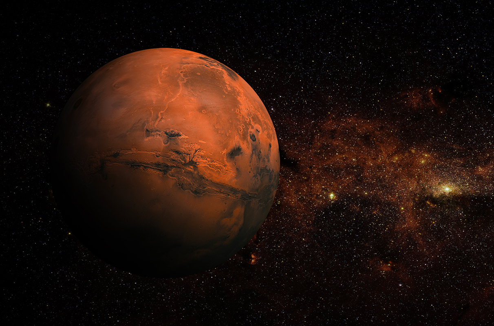
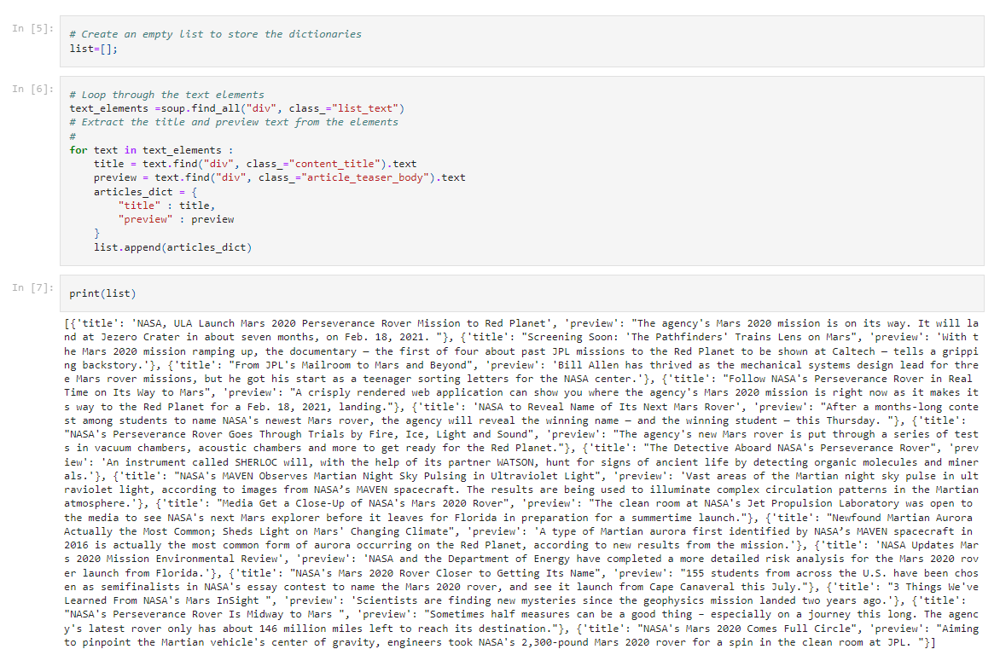
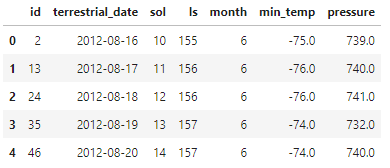
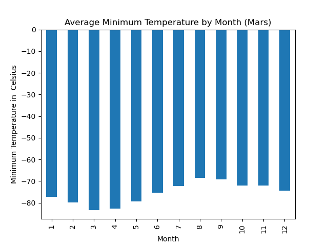
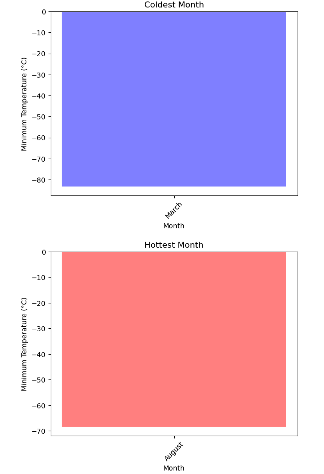
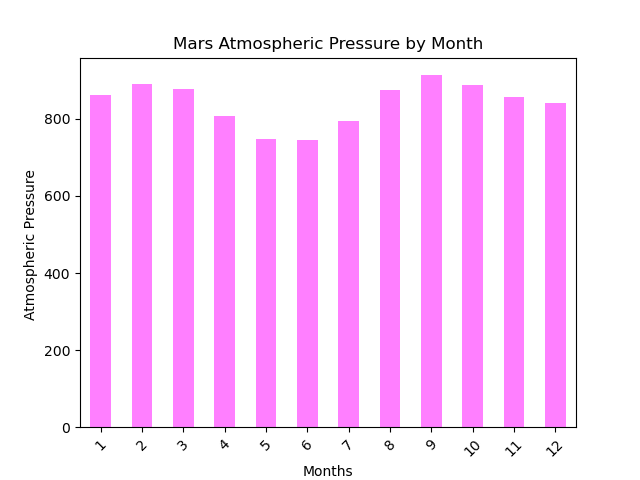
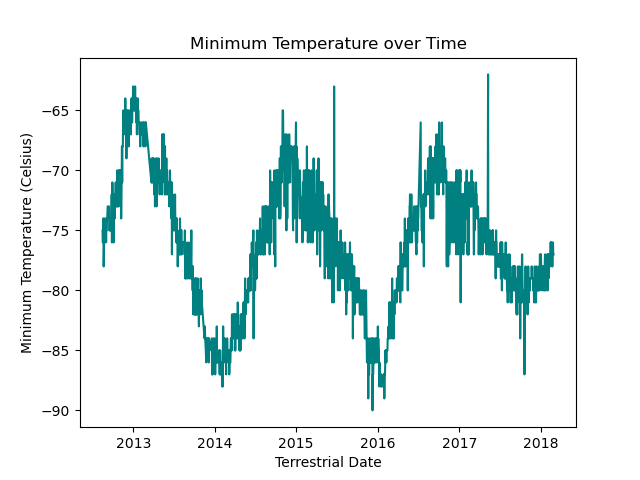

# Mission-to-Mars

## Overview

This project aims at web-scraping and data analysis for the mission to Mars program. The main goal is to organize, analyze, and visualize the data.

## Deliverable 1: 

- A Jupyter notebook containing code that scrapes the Mars news titles and preview text.

### Extract the title and preview text from the elements

## Deliverable 2: 
- A Jupyter notebook containing code that scrapes the Mars weather data and that cleans, visualizes, and analyzes that data.

### Create a Pandas DataFrame by using the list of rows and a list of the column names

### Average Minimum Temperature by Month (Mars)

### Identify the coldest and hottest months 

### Average pressure by Martian month

### How many terrestrial (earth) days are there in a Martian year?

On average, the third month has the coldest minimum temperature on Mars, and the eighth month is the warmest. But it is always very cold there in human terms!

Atmospheric pressure is, on average, lowest in the sixth month and highest in the ninth.

The distance from peak to peak is roughly 1425-750, or 675 days. A year on Mars appears to be about 675 days from the plot. Internet search confirms that a Mars year is equivalent to 687 earth days.

